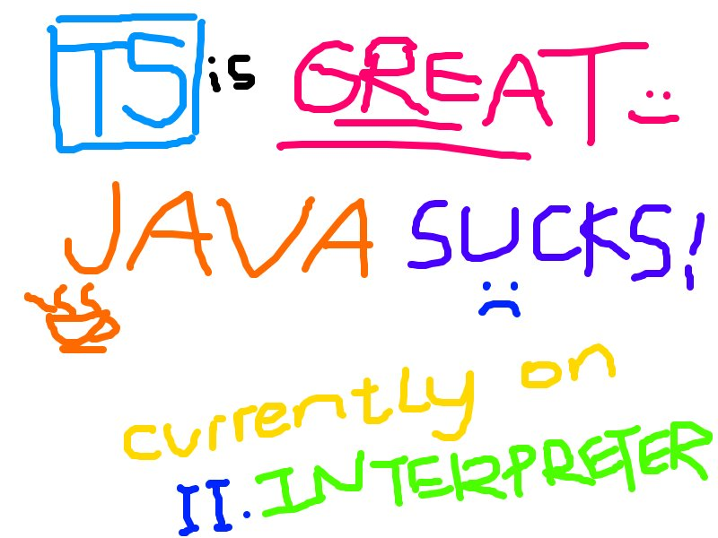

lol i do this for fun

i decided to write interpreter in TS because i can't even figure out how to build Java programs without an IDE, so check out [loxts - Lox implementation in Typescript](./loxts/)
